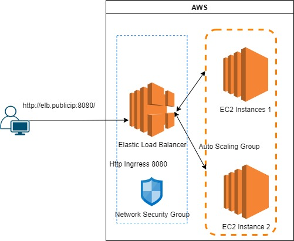

# Define provider
Refer provider aws from [Example](https://registry.terraform.io/providers/hashicorp/aws/latest/docs#example-usage)

## EC2 Instance 
Refer EC2 instance creation from [instance](https://registry.terraform.io/providers/hashicorp/aws/latest/docs/resources/instance)
Image ID used is Ubuntu, Please note that busybox comes out of box in ubuntu

## User data
Refer user data options from [user_data](https://registry.terraform.io/providers/hashicorp/aws/latest/docs/resources/instance#user_data)

## Multiline 
Refer <<-EOF syntax from [syntax](https://www.terraform.io/language/configuration-0-11/syntax)

## Security Group
Refer Security group creation from [security group](https://registry.terraform.io/providers/hashicorp/aws/latest/docs/resources/security_group)

## Terraform input variable
terraform type number is used for server port, for more input types refer [expressions](https://www.terraform.io/language/expressions/typeste)

## Terrform output variable
get the public ip of the EC2 instance, for more info refer [output](https://registry.terraform.io/providers/hashicorp/aws/latest/docs/resources/instance#public_ip)

## Launch Configuration
To Create Launch Configuration, we need the image ID,EC2 instance & life cycle to create before destroy set to true, refer [launch-config](https://registry.terraform.io/providers/hashicorp/aws/latest/docs/resources/launch_configuration)

## Auto Scaling Group
To Create Auto Scaling Group refer [auto scaling group](https://registry.terraform.io/providers/hashicorp/aws/latest/docs/resources/autoscaling_group)

## Data Source
To get the data out of the data source, you can use the following syntax
```
data.<PROVIDER>_<TYPE>.<NAME>.<ATTRIBUTE>
```
## Application Load Balancer
Layer 7 Application load balancer refer [lb](https://registry.terraform.io/providers/hashicorp/aws/latest/docs/resources/lb)

## Application Listener
Application Listener refer [listener](https://registry.terraform.io/providers/hashicorp/aws/latest/docs/resources/lb_listener)

## Application Load Balancer Target Group
ALB Target group refer [lb-target-group](https://registry.terraform.io/providers/hashicorp/aws/latest/docs/resources/lb_target_group)

## Listener Rule
For more listener rule refer [rule](https://registry.terraform.io/providers/hashicorp/aws/latest/docs/resources/lb_listener_rule)

## ARN (Amazon Resource Names)
Refer [ARN's](https://docs.aws.amazon.com/general/latest/gr/aws-arns-and-namespaces.html)

## Layout Diagram


## Terraform backend Config
Terraform backend config is added for the state to stored in S3 & lock in the dynamoDB Table
Refer [Backend Config](https://www.terraform.io/language/settings/backends/configuration#using-a-backend-block)

### Init Terrform 
command to initialize terraform 
```
terraform init
```
Command to initialize with backend config
```
terraform init --backend-config=backend.hcl
```